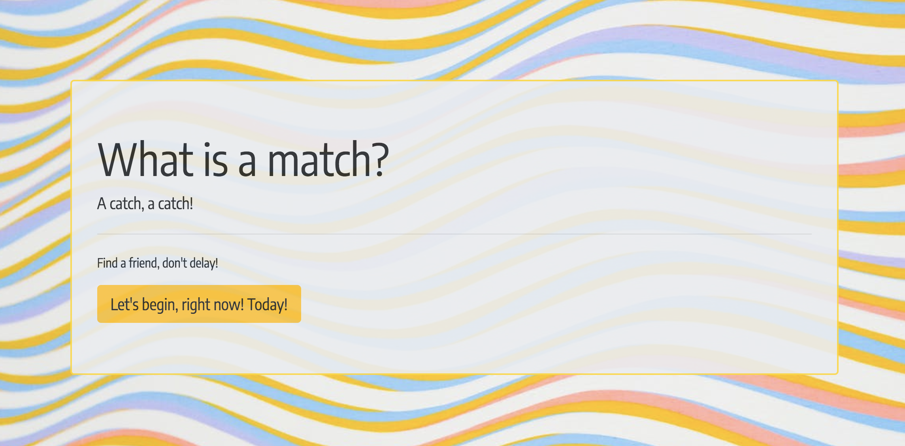
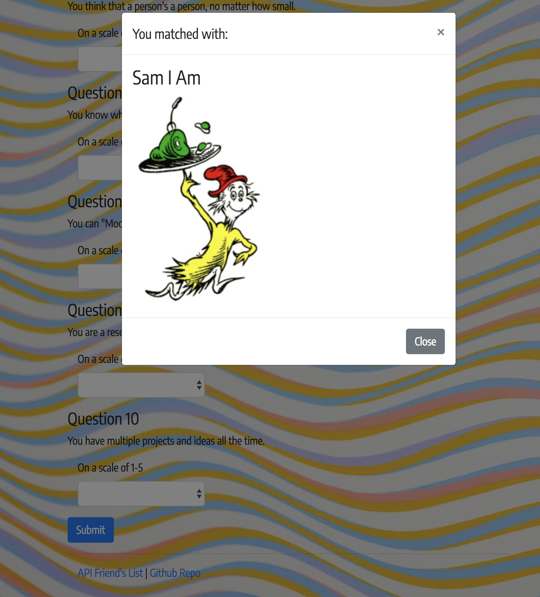

# friend-finder

Friend Finder is an app designed to pair you with your most suitable match based on our super technical array of personality questions.

I utilized [Bootstrap](http://getbootstrap.com/), [Node](https://nodejs.org/docs/latest/api/index.html) and several [NPM packages](https://www.npmjs.com/) including [Express](https://www.npmjs.com/package/express), [Body-parser](https://www.npmjs.com/package/body-parser), and [Path](https://nodejs.org/docs/latest/api/path.html).

After our user answers the survey questions, they will be matched with the most similar person from our API friends array. The match will be displayed in a Bootstrap Modal.

Find your match [here](https://fast-sands-72490.herokuapp.com/)!

